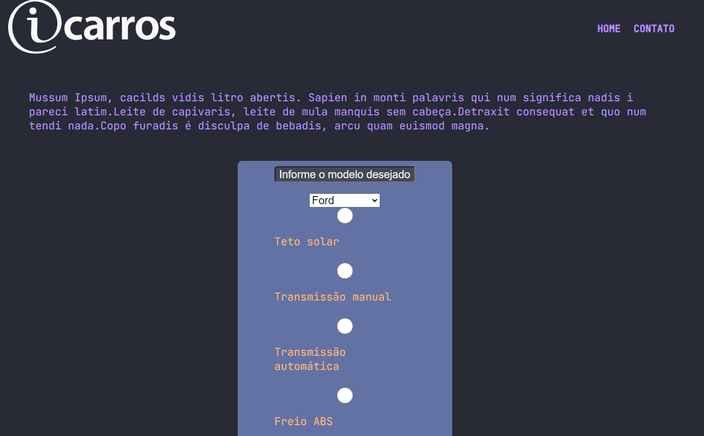
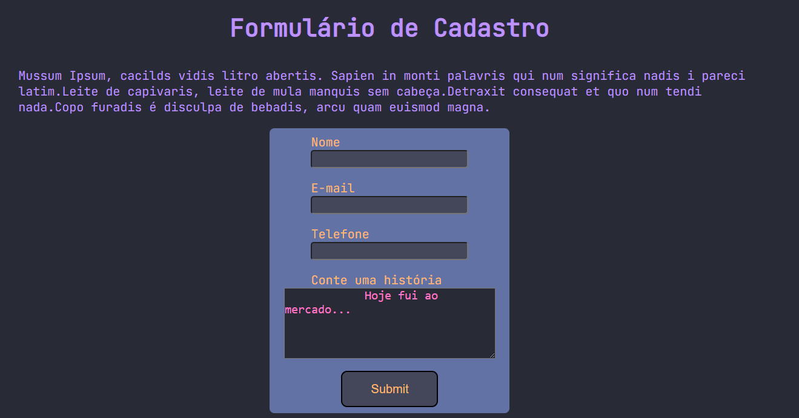

# Projeto 03: Html e Sass - iCarros

## <"acelera"><"iCarros_Tech"> - Gama Academy

O objetivo desse projeto foi colocar em prática os conhecimentos adquiridos durante as aulas síncronas e assíncronas do Acelera Tech iCarros, feitos em parceria de [Gama Academy](https://www.gama.academy/) e o [iCarros](https://www.icarros.com.br/principal/index.jsp).

## Tecnologias utilizadas

- HTML.
- CSS.
- JavaScript.

## Introdução

O projeto foi feito durante as aulas para ter um estilo que lembre o próprio site do [iCarros](https://www.icarros.com.br/principal/index.jsp).

Nessa aula foram explicados os conceitos de Sass, além de como consumir dados de uma api externa.

## Preview do projeto

### Acessar o site do Projeto

O projeto está hospedado no Netilify, podendo ser acessado por esse [link]().

## Créditos

Aulas ministradas pelo professor [Douglas Morais](https://github.com/mrdouglasmorais), e projeto desenvolvido por Guilherme de Araujo Gabriel.
